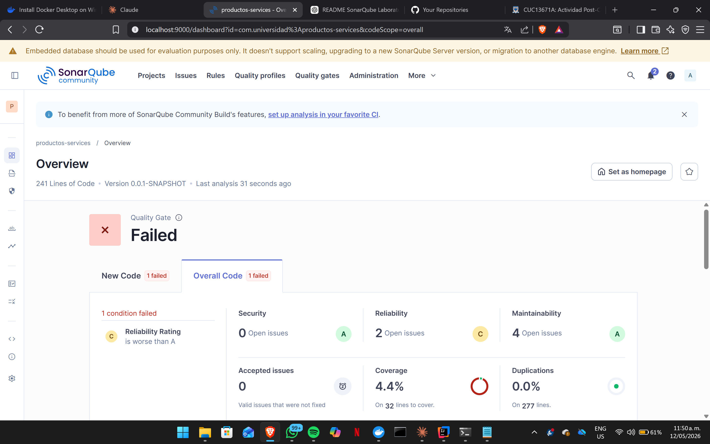
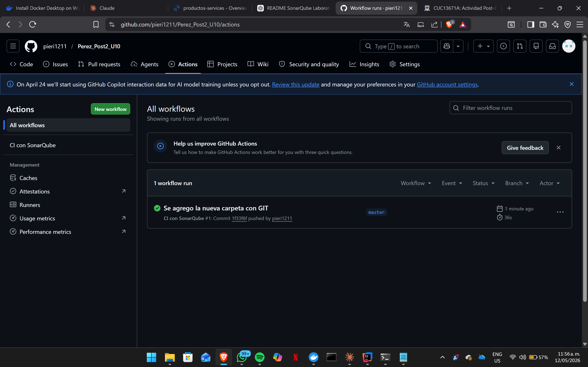

 analisis Sonarqube post2 U10
 github sonarqube

# Productos Service — Mejora de Calidad con SonarQube y GitHub Actions

## 1. Descripción del proyecto

Este repositorio corresponde al laboratorio de la Unidad 10: Métricas de Calidad y SonarQube, Post-Contenido 2. El objetivo principal fue continuar el análisis iniciado en el Post-Contenido 1 mediante la configuración de un Quality Gate personalizado, la corrección de hallazgos identificados por SonarQube, la ejecución de un segundo análisis para verificar la mejora de las métricas y la integración del proceso de inspección dentro de GitHub Actions.

El proyecto analizado corresponde a una aplicación Spring Boot denominada `Productos Service`, desarrollada con Maven y evaluada mediante SonarQube, JaCoCo y un flujo de integración continua en GitHub.

---

## 2. Tecnologías utilizadas

- Java JDK 21
- Spring Boot
- Maven
- SonarQube Community Edition
- Docker Desktop
- JaCoCo
- Git
- GitHub
- GitHub Actions

---

## 3. Objetivo del laboratorio

El propósito de este laboratorio fue aplicar un proceso básico de mejora continua sobre la calidad del código fuente. Para ello, se configuró un Quality Gate personalizado en SonarQube, se corrigieron problemas de confiabilidad y mantenibilidad detectados en el análisis inicial, se ejecutó un nuevo análisis estático y se documentaron las evidencias mediante capturas del dashboard de SonarQube y del repositorio en GitHub.

---

## 4. Quality Gate configurado

Se creó un Quality Gate personalizado con el nombre:

```text
Estándar Universidad

Este Quality Gate fue configurado con las siguientes condiciones de aceptación:

Condición	Regla aplicada
Bugs	Bloquear si Bugs es mayor que 0
Cobertura	Bloquear si Coverage es menor que 60%
Code Smells	Bloquear si Code Smells es mayor que 5
Duplicación	Bloquear si Duplicated Lines (%) es mayor que 5%

El Quality Gate fue asignado al proyecto Productos Service desde la configuración del proyecto en SonarQube.

5. Problemas corregidos
5.1 Corrección del bug principal: retorno de null

En el análisis inicial se identificó un bug relacionado con el método buscar(Long id), el cual retornaba null cuando no encontraba un producto. Esta práctica puede producir errores en tiempo de ejecución, especialmente NullPointerException, si el objeto retornado es utilizado sin validación previa.

Código antes de la corrección
public Producto buscar(Long id) {
    return productoRepository.findById(id).orElse(null);
}
Código después de la corrección
public Producto buscar(Long id) {
    return productoRepository.findById(id)
            .orElseThrow(() ->
                    new NoSuchElementException("Producto no encontrado: " + id));
}

Con esta modificación, el método deja de retornar un valor nulo y pasa a lanzar una excepción descriptiva cuando el producto no existe. Esto mejora la confiabilidad del servicio y permite manejar el error de forma explícita.

5.2 Corrección del Code Smell: inyección de dependencias por atributo

En la versión inicial del código se utilizaba @Autowired directamente sobre el atributo del repositorio. Esta práctica reduce la claridad del diseño y dificulta la construcción de pruebas unitarias.

Código antes de la corrección
@Autowired
private ProductoRepository repo;
Código después de la corrección
private final ProductoRepository productoRepository;

public ProductoService(ProductoRepository productoRepository) {
    this.productoRepository = productoRepository;
}

La inyección por constructor permite declarar explícitamente las dependencias obligatorias de la clase, mejora la mantenibilidad y facilita la prueba del servicio.

5.3 Corrección del Code Smell: nombre genérico de variable

Se reemplazó el nombre genérico repo por productoRepository, con el fin de mejorar la legibilidad del código.

Código antes de la corrección
private ProductoRepository repo;
Código después de la corrección
private final ProductoRepository productoRepository;

Este cambio permite que el nombre de la variable represente con mayor precisión su responsabilidad dentro de la clase.

5.4 Corrección del Code Smell: validación de cadena vacía

El método procesarProducto utilizaba equals("") para validar si el nombre estaba vacío. Esta validación no contempla correctamente cadenas compuestas únicamente por espacios en blanco.

Código antes de la corrección
if (n == null || n.equals("")) {
    throw new IllegalArgumentException("nombre requerido");
}
Código después de la corrección
if (nombre == null || nombre.isBlank()) {
    throw new IllegalArgumentException("El nombre no puede estar vacío");
}

El uso de isBlank() permite validar cadenas vacías y cadenas formadas solo por espacios, mejorando la robustez de la validación.

5.5 Corrección del Code Smell: método con múltiples responsabilidades

El método procesarProducto concentraba varias responsabilidades: validar datos, crear la entidad y guardar el producto. Para reducir la complejidad, se extrajo la validación a un método privado.

Código después de la refactorización
public Producto procesarProducto(String nombre, Double precio, Integer stock) {
    validarDatos(nombre, precio, stock);

    Producto producto = new Producto();
    producto.setNombre(nombre.strip());
    producto.setPrecio(precio);
    producto.setStock(stock);

    return productoRepository.save(producto);
}

private void validarDatos(String nombre, Double precio, Integer stock) {
    if (nombre == null || nombre.isBlank()) {
        throw new IllegalArgumentException("El nombre no puede estar vacío");
    }

    if (precio == null || precio <= 0) {
        throw new IllegalArgumentException("El precio debe ser mayor a cero");
    }

    if (precio > 999999) {
        throw new IllegalArgumentException("El precio excede el máximo permitido");
    }

    if (stock == null || stock < 0) {
        throw new IllegalArgumentException("El stock no puede ser negativo");
    }
}

Esta refactorización mejora la separación de responsabilidades, disminuye la complejidad del método principal y facilita el mantenimiento del servicio.

6. Comparación de métricas antes y después
Métrica	Análisis inicial	Segundo análisis	Resultado
Bugs	X	X	Mejoró / Sin cambios
Vulnerabilidades	X	X	Mejoró / Sin cambios
Code Smells	X	X	Mejoró
Cobertura	X%	X%	Mejoró / Sin cambios
Duplicación	X%	X%	Mejoró / Sin cambios
Quality Gate	Failed / Passed	Failed / Passed	Mejoró / Cumple

Nota: Los valores deben completarse con los datos exactos mostrados en el dashboard de SonarQube después del segundo análisis.

7. Ejecución del segundo análisis

Después de aplicar las correcciones, se ejecutó nuevamente el análisis con Maven, JaCoCo y SonarQube mediante el siguiente comando:

mvn clean verify sonar:sonar -Dsonar.token=TU_TOKEN

El análisis permitió verificar la reducción de bugs y code smells respecto al estado inicial del proyecto.

8. Integración con GitHub Actions

Se agregó un workflow de integración continua en GitHub Actions para ejecutar el proceso de compilación y verificación del proyecto en cada push o pull request hacia la rama principal.

El archivo fue ubicado en la siguiente ruta:

.github/workflows/ci.yml
Workflow configurado
name: CI con SonarQube

on:
  push:
    branches: [ main ]
  pull_request:
    branches: [ main ]

jobs:
  build-and-analyze:
    runs-on: ubuntu-latest

    steps:
      - name: Descargar código fuente
        uses: actions/checkout@v4
        with:
          fetch-depth: 0

      - name: Configurar Java 21
        uses: actions/setup-java@v4
        with:
          java-version: "21"
          distribution: "temurin"
          cache: maven

      - name: Compilar y ejecutar pruebas
        run: mvn -B clean verify --no-transfer-progress

El workflow permite validar automáticamente que el proyecto compile correctamente y que las pruebas se ejecuten sin errores dentro del entorno de GitHub Actions.

10. Estructura del repositorio
productos-service/
│
├── .github/
│   └── workflows/
│       └── ci.yml
│
├── docs/
│   ├── sonarqube-dashboard.png
│   ├── github-repository.png
│   └── github-actions.png
│
├── src/
│   ├── main/
│   │   └── java/
│   │       └── com/
│   │           └── universidad/
│   │               └── productosservice/
│   │                   ├── domain/
│   │                   │   └── Producto.java
│   │                   ├── repository/
│   │                   │   └── ProductoRepository.java
│   │                   ├── service/
│   │                   │   └── ProductoService.java
│   │                   └── ProductosServiceApplication.java
│   │
│   └── test/
│       └── java/
│           └── com/
│               └── universidad/
│                   └── productosservice/
│                       └── service/
│                           └── ProductoServiceTest.java
│
├── pom.xml
├── sonar-project.properties
└── README.md
11. Commits realizados

Durante el desarrollo del laboratorio se realizaron commits descriptivos que evidencian el avance progresivo del trabajo:

1. Documentación del análisis inicial con SonarQube
2. Corrección de bug y code smells principales
3. Configuración de GitHub Actions y segundo análisis de calidad
12. Resultado final

El segundo análisis realizado en SonarQube permitió comprobar la mejora del proyecto frente al estado inicial. Se corrigió el bug relacionado con el retorno de null, se aplicaron refactorizaciones sobre los code smells principales y se configuró un workflow de GitHub Actions para automatizar la verificación del proyecto.

Con este laboratorio se evidencia la aplicación de un ciclo básico de inspección de calidad de software: detección de problemas, refactorización, medición posterior y automatización del control de calidad dentro del repositorio.
